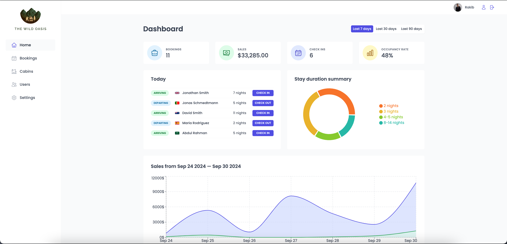
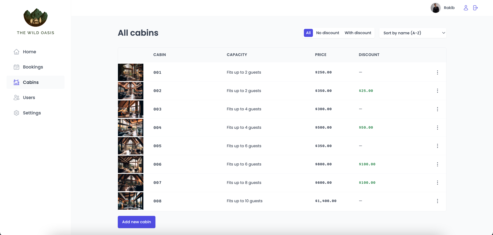
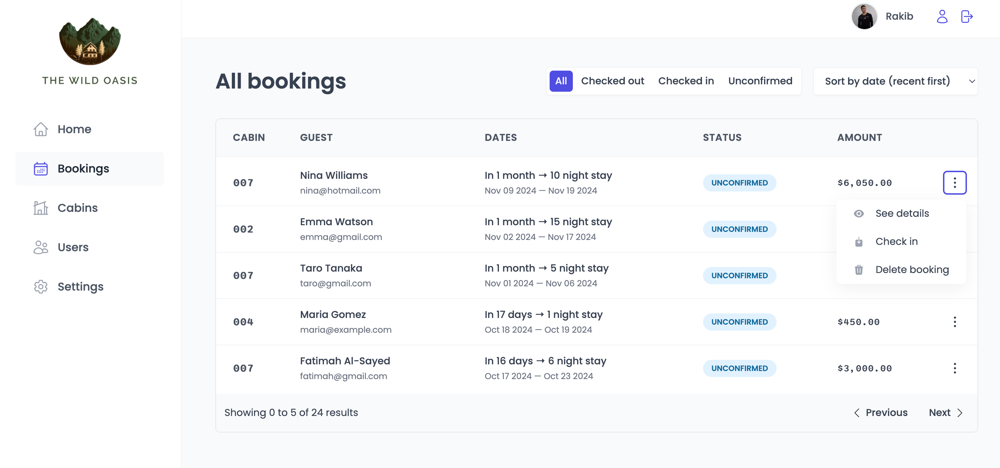

# The Wild Oasis - Hotel Management System

Welcome to **The Wild Oasis**, a single-page hotel management system designed to streamline the day-to-day operations of a hotel. This web application allows hotel employees to manage cabins, bookings, guests, and payments efficiently.
## Live Website

[The Wild Oasis - Live Site](https://the-wild-oasiss-admin.netlify.app/)

## Screenshots

### Dashboard Overview


### Cabin Management


### Booking Table


## Technologies Used

- **Frontend**: ReactJS, Styled Components
- **Routing**: React Router
- **Data Fetching & State Management**: React Query
- **Backend**: Supabase
- **Database**: Supabase (PostgreSQL)
- **Authentication**: Supabase Auth

## Features

### 1. Authentication
- **Hotel employees only**: Users need to be logged into the application to perform tasks.
- **New user signup**: Users can only be signed up inside the application to ensure that only actual hotel employees can access it.
- **Profile Management**: Users can upload an avatar, change their name, and reset their password.

### 2. Cabins Management
- **Cabin Overview**: A table view that shows all cabins, including photo, name, capacity, price, and current discounts.
- **Edit Cabins**: Users can update or delete a cabin's details.
- **Add New Cabins**: Employees can create new cabins by uploading photos and adding cabin details.

### 3. Bookings
- **Booking Overview**: Displays all bookings with arrival and departure dates, status, paid amount, and linked cabin and guest data.
- **Booking Statuses**: Track bookings as "unconfirmed," "checked in," or "checked out."
- **Detailed Information**: Shows the number of guests, nights, guest observations, breakfast preferences, and more.

### 4. Check-in/Check-out
- **Manage Bookings**: Users can delete, check-in, or check-out bookings as guests arrive or depart.
- **Payment Management**: If payment is not yet made on guest arrival, employees can confirm the receipt of payment.
- **Breakfast Management**: On check-in, users can add a breakfast option for the entire stay if the guest hasn’t already.

### 5. Guest Information
- **Comprehensive Guest Data**: Each guest's profile includes full name, email, national ID, nationality, and a country flag for easy identification.

### 6. Dashboard
- **Overview of Hotel Operations**: Displays important statistics for the last 7, 30, or 90 days.
- **Guest Check-in/Check-out List**: Shows the list of guests checking in and out on the current day.
- **Sales and Occupancy Stats**: Includes charts showing both "total" sales and "extras" sales (such as breakfast).

### 7. Settings
- **App-wide Settings**: Users can define various settings, such as breakfast prices, minimum and maximum nights per booking, and more.

## Installation

1. Clone the repository:
   ```bash
   git clone https://github.com/iamrakib097/the-wild-oasis.git
   ```
2. Install the dependencies:
  ```bash
  npm install
   ```
3. Start the development server:
```bash
  npm run dev
   ```
## Usage
Once the server is up and running, you can log in as a hotel employee to manage cabins, bookings, guests, and payments. Access the dashboard for a quick overview of hotel operations and statistics.
### Login Credentials:
- **Email**: admin@example.com
- **Password**: password

## Contributing
Feel free to open issues or pull requests for improvements or new features. Contributions are welcome
